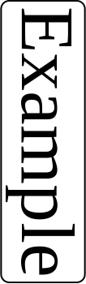
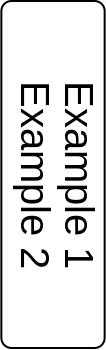

## This program

This is a small tool to generate png graphics for use with a label printer
from command line.

## Usage

    ./label -h
    Usage: label [OPTION...]
      -f, --font=STRING        set font face to use
      -p, --fontsize=INT       set font size in pixels
      -w, --width=INT          set width of label in pixels (default: 350)
      -h, --height=INT         set height of label in pixels (default: 106)
      -r, --rotate=INT         rotation of the image (default: 0)
          --noframe            do not draw a box around the text
          --ob=INT             extra border space around the frame
          --ib=INT             extra border space inside the frame
          --rb=INT             extra outer border space to the right
          --lb=INT             extra outer border space to the left
          --tb=INT             extra outer border space to the top
          --bb=INT             extra outer border space to the bottom
      -o, --outfile=STRING     output file name
      -h, --help               this help screen

The default size is set for 12mm paper of a Brother QL label printer (106 pixel height), after 90° rotation.

The outer border is considered between the label edge and the frame, while the inner border defines the (extra) space between the text and the frame. Further one-sided outer border arguments are additive to the global outer border.

Each non-option argument is interpreted as a line to print into the label.

## Building

Just type make.

Requirements are librsvg-2, pangocairo and popt.

## Labels

Labels are created as rectangles (optionally with rounded corners) with the text inside. They can be optionally rotated by 90, 180 or 270 degrees as needed for printing. Text is centered inside the label. The font size is automatically scaled to fit the height, unless explicitly given with -p.

    ./label -o example1.png -r 90 Example
    ./label -o example2.png -r 90 -f Sans Example\ 1 Example\ 2

